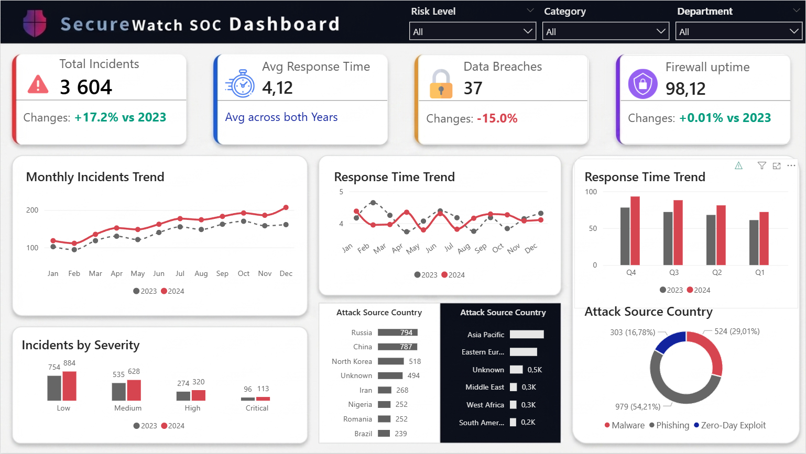

# 🛡️ SOC Security Dashboard - Power BI Analytics

## 📌 Project Overview
This project presents an interactive **Security Operations Center (SOC) Dashboard** developed in Power BI. It is designed to provide high-level and granular visibility into organizational cybersecurity health, allowing security leads to monitor incident volumes, track response efficiency, and identify geographical threat patterns.

### 📊 Key Performance Indicators (KPIs)
* **Incident Tracking:** Real-time monitoring of total incidents.
* **YoY Performance:** Automated tracking of changes compared to the previous year (+17.2% vs 2023).
* **Operational Efficiency:** Analysis of the **Average Response Time** to measure team performance.
* **Security Posture:** Monitoring firewall uptime and data breach status.

---

## 🛠️ Technical Stack & Tools
* **Tool:** Power BI Desktop
* **Modeling:** Star Schema Architecture
* **DAX:** Advanced measures for YoY calculations and dynamic labeling.
* **Data Source:** PostgreSQL / Security Logs
* **ETL:** Power Query for data cleansing and normalization.

---

## 📐 Data Engineering & Modeling
The dashboard is built on a solid data foundation:
* **Star Schema:** Optimized for performance using a central Fact table (`fact_incidents`) connected to multiple Dimensions (`dim_date`, `dim_attack_source`, `dim_severity`).
* **DAX Logic:** Implementation of time-intelligence functions to calculate year-over-year growth and dynamic callout labels.
* **Data Integrity:** Automated data cleaning in Power Query to handle nulls and standardize categories.

---

## 📸 Dashboard Preview

*(Note: Upload your screenshot to assets/images/ folder)*

---

## 🚀 How to Run the Project
1. **Clone the repository:**
   ```bash
   git clone [https://github.com/najmiddinov-code/SOC-Security-Dashboard-PowerBI.git](https://github.com/najmiddinov-code/SOC-Security-Dashboard-PowerBI.git)
